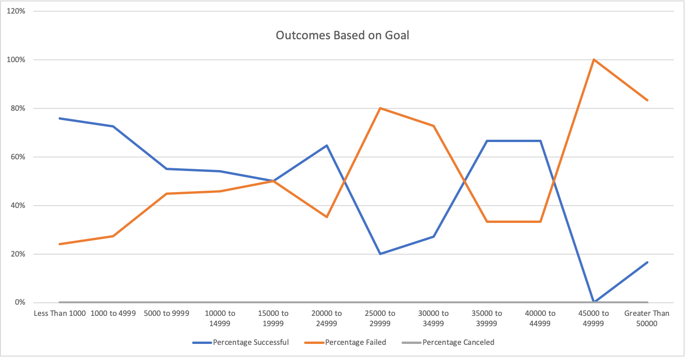

# Kickstarting with Excel

## Success of Kickstarter Campaigns Based on Launch Date and Funding Goals

### Background / Overview

Louise Doe is a US-based playwright/producer. She is looking to fund a new production via [Kickstarter](https://www.kickstarter.com/learn), an online platform that allows people (referred to as "Creators") to collect donations, largely from individuals (known as "Backers"), towards various creative projects (also known as "crowdfunding"). In addition to a description of what the Backers will be funding and why, Creators set various criteria for their Kickstarter "campaign", including a goal amount for pledged funds, a launch date for the campaign, and how long the campaign will run (or deadline). Kickstarter campaigns are all-or-nothing. Money is pledged toward the goal, but no funds are actually taken until the goal is met. If the goal is not met by the established deadline, the campaign "fails", and no money changes hands. Creators can also cancel a campaign for various reasons. When a campaign is cancelled, no money changes hands, and it can be relaunched later, though Backers to the previous campaign do not automatically carry over. 

Crowdfunding is different than more traditional individual funding methods, like venture capital or a bank loan. Since crowdfunding relies on what are essentially a collection of small individual donation requests, but occurring within a shared public environment (i.e. potential Backers can see in realtime how the campaign is doing and how much other Backers have contributed, and when), it can be more susceptible to group psychology. Backers may not want to contribute towards a campaign that appears unlikely to succeed. Conversely, a campaign that is doing well might actually "pick up speed", as other Backers are encouraged to join before it reaches the funding goal so they can say they participated. Campaigns might also be susceptible to other macro population trends such as time of year for various reasons. Given that, independent of the merits of the specific campaign, it is generally held that how a campaign is set up may affect its chances of success. However, most best practices in this area are anecdotal at best. As a result, Ms. Doe has engaged us. Ms. Doe's previous Kickstarter campaign came close, but did not end up meeting its funding goals. In order to optimize her next campaign, she would like us to analyze available public Kickstarter data to determine any potential useful trends, in particular with regards to campaign launch date and funding goals.

## Analysis and Challenges

We collected publicly available data regarding a wide variety of Kickstarter campaigns across a period of approximately 8 years. Data included most common parameters of the various campaigns, such as launch date, deadline, goal amount, pledged amount, whether the campaign funded successfully, total number of backers, etc. Geo and categorical data was also made available. In an effort to isolate the data most useful to Ms. Doe's purposes, we restricted our analysis to campaigns involving Theater Productions and Plays. That data was then broken down independently to analyze any potential trends in funding success based on Launch Date, and funding success based on the Funding Goal.

### Analysis of Outcomes Based on Launch Date

[Theater Outcomes Based on Launch Date](/Theater_Outcomes_vs_Launch.png)

Data for successful, failed, and cancelled Theater campaigns across the available time period were assembled into a single line graph. Theater campaigns overall were relatively successful, with successes tracking at or above failures across all launch dates. In terms of the ratio of successful to failed campaigns, we see a minor peak in February, a small retraction into March, then a rapid increase to a max peak in May. We then see a decline through the Summer into early Fall, with a slight improvement in September. From there, things tighten into Winter, reaching a low point of effectively 1:1 in December before improving back up sharply in January. 

A raw analysis would suggest that the optimal time for a campaign launch would be in April - July (peak May), with a secondary option of February. We would specifically suggest against launching a campaign between September and the end of the year. 

The current chart is provided in absolute numbers, but it may be more useful to present it as a ratio, so as to not visually prejudice the periods of low total campaigns.

Note: Cancelled campaigns remained low and steady enough across the time period, to the point they can be disregarded in this analysis. 

### Analysis of Outcomes Based on Goals

Data is presented here as a percentage line graph of successful vs. unsuccessful campaigns, broken up by various funding goal "buckets". The buckets are arranged between $0 and $50k+ in $5k increments, except for the lowest bucket (<$1k). Cancelled campaigns were analyzed as well, but were not present within this data set. 

What we see here is more bimodal. Across the range analyzed, we see two distinct advantageous points: at the very low end (<$1k), and at the moderate high end ($35k - $45k). One thing to note here is that although this chart shows the percentages, it does not show distribution. Based on the raw data, we show a significant dropoff in total campaigns above $25k. Data above that range is much more limited and may be less reliable in terms of predictive usefulness. Given that, and based on information provided about Ms. Doe's previous projects, we would suggest focusing on the lower end of the scale.

### Challenges and Difficulties Encountered

The analysis presented here is only a very rough approximation, and lacks significant granularity. Data in both sets is across an 8 year span, and it is unclear if it is consistent year to year; a year-over-year multiple line chart would present a better visualization of that. There is significant noise within the data set. Since there is no approval process for a campaign (other than basic rules regarding propriety and legality), there is no restriction on campaigns that are unlikely on face to be funded. There is also no control for the actual appeal of the campaign; all analysis is based on raw numbers, without regard to any particular specific merit. It's also unclear from this analysis if there may be a regional element; it may be worth breaking down the results across geos, or limiting it specifically to Ms. Doe's preferred regions. 

## Results

Based on available data, we would suggest a low to low moderate campaign goal (<$5k), with a launch date from April to August (optimally May), with a secondary option of February. 

